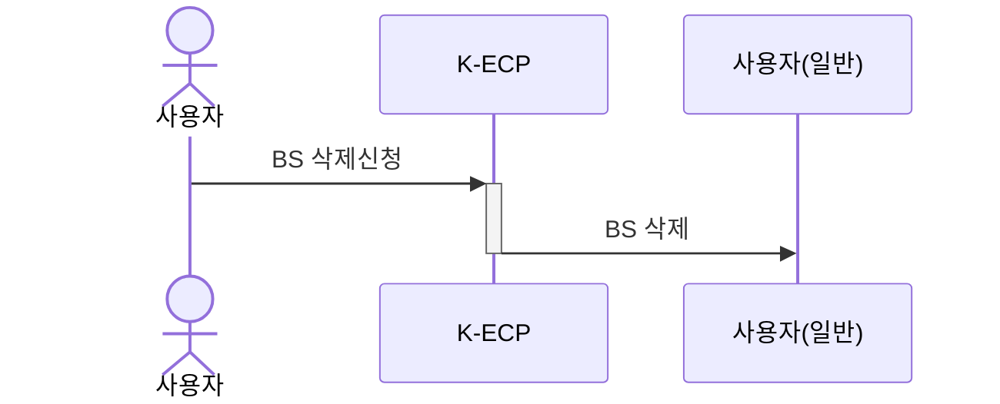

[문서 최종 수정일자 : 2023-09-20]: # 

[문서 최종 수정자 : 신승규]: # 

# Block Storage 삭제하기

이 안내서를 사용하여 **K-ECP Block Storage(이하. BS)** 자원을 삭제할 수 있습니다. BS 자원 삭제 신청서를 작성하고 정리하는 방법을 안내합니다.

사용하지 않는 BS 서비스를 삭제하여 자원낭비를 줄여 효율적으로 K-ECP 서비스를 활용할 수 있습니다.

### 관련 안내서

* [File Storage 삭제하기](./FileStorage_delete.md)

### 목차

[개요](#개요)

[전제 조건](#전제-조건)

[1단계: Block Storage umount](#1단계-block-storage-umount)

[2단계: Block Storage 연결해지](#2단계-block-storage-연결해지)

[3단계: Block Storage 삭제 신청](#3단계-block-storage-삭제-신청)

[다음 단계](#다음-단계)

---

<span id="abstract"/>

## 개요

K-ECP BS 서비스를 삭제하기 위해서는 아래와 같은 프로세스로 진행됩니다.



---

<span id="precondition"/>

## 전제 조건

* 삭제 가능한 BS 서비스가 존재해야합니다.

---

<span id="step1"/>

## 1단계: Block Storage umount

> :warning: **주의사항:** Block Storage를 정리하면 해당 Storage에 저장된 데이터를 복구할 수 없습니다.

1. SSH 클라이언트(Putty, Windows 터미널 등)을 통해 Block Storage를 할당 받은 서버로 접속
   
   * 본 가이드에서는 윈도우 명령 프롬프트(터미널)을 이용한 SSH 접속
   
   ```powershell
   ssh -p[ssh Port] kecpuser@[VM_IP_address]
   ```
   
   ```
   kecpuser@[VM]'s password:
   Last login: Wed May 31 13:41:07 2023 from [IP]
   #################################################################
   #                   _    _           _   _                      #
   #                  / \  | | ___ _ __| |_| |                     #
   #                 / _ \ | |/ _ \ '__| __| |                     #
   #                / ___ \| |  __/ |  | |_|_|                     #
   #               /_/   \_\_|\___|_|   \__(_)                     #
   #                                                               #
   #           You are entering into a secured area!               #
   #                                                               #
   #                      This service                             #
   #                   is restricted  to                           #
   #           Cloud Department Administrator only.                #
   #                                                               #
   #          All activities on this system are logged.            #
   #  Unauthorized access will be fully investigated and reported  #
   #        to the appropriate law enforcement agencies.           #
   #################################################################
   Last login: Wed May 31 13:41:07 2023 from [IP]
   ```

2. 현재 Block Storage 상태 확인

```bash
df -h
```

```
Filesystem      Size  Used Avail Use% Mounted on
devtmpfs        1.8G     0  1.8G   0% /dev
tmpfs           1.9G     0  1.9G   0% /dev/shm
tmpfs           1.9G   25M  1.8G   2% /run
tmpfs           1.9G     0  1.9G   0% /sys/fs/cgroup
/dev/vda3        50G  2.5G   48G   5% /0907_data
/dev/vda2       100M  5.8M   95M   6% /boot/efi
tmpfs           374M     0  374M   0% /run/user/901
```

3. 현재 마운트 상태인 Block Storage umount

```bash
umount -a
```

```bash
df -h
```

* df -h 명령어를 통해서 umount됨을 확인
  
  ```
  Filesystem                        Size  Used Avail Use% Mounted on
  devtmpfs                          1.8G     0  1.8G   0% /dev
  tmpfs                             1.9G   25M  1.8G   2% /run
  tmpfs                             1.9G     0  1.9G   0% /sys/fs/cgroup
  /dev/vda3                          50G  2.5G   48G   5% /
  tmpfs                             374M     0  374M   0% /run/user/901
  /dev/vda2                         100M  5.8M   95M   6% /boot/efi
  ```
4. umount된 가상 경로 삭제

```bash
rm -r /0907_data
```

```
rm: remove directory '/0907_data/'?
```

* yes 입력

---

<span id="step2"/>

## 2단계: Block Storage 연결해지

1. K-ECP User Console에서 `서비스 현황` > `스토리지` 로 이동

2. Block Storage 필드에서 삭제하고자 하는 Block Storage의 디스크명을 확인

3. 연결상태의 `연결됨`표시를 클릭하여 연결해지

4. 연결상태에서 `미연결`표시로 변경 확인

---

<span id="step3"/>

## 3단계: Block Storage 삭제 신청

1. K-ECP User Console에서 `서비스 변경 및 삭제 신청` 클릭

2. 서비스 변경 및 삭제 신청 페이지에서 삭제신청 탭 클릭

3. 삭제신청 내역 작성
   
   * 프로젝트: *삭제할 BS가 포함된 프로젝트 선택*
   
   * 자원: *블록디스크 선택*
   
   * 가상서버 검색: *디스크명을 확인하여 삭제할 BS를 선택*

4. 삭제신청 버튼 클릭

---

<span id="nextstep"/>

## 다음 단계

* BS삭제를 통해서 프로젝트에서 사용하지 않는 Storage를 정리하여 K-ECP 서비스 사용시 비용을 절감하여 사용할 수 있습니다.
