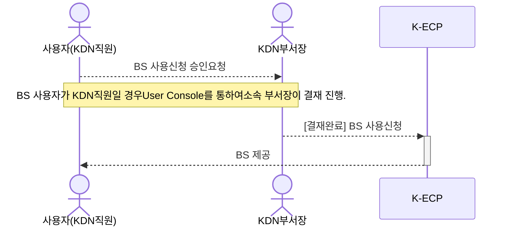
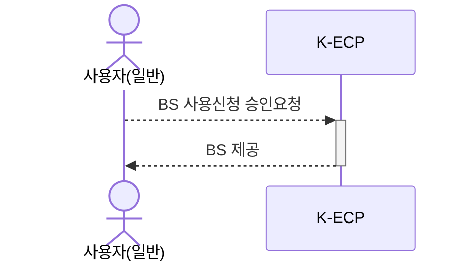

# Block Storage 시작하기

이 안내서를 사용하여 **K-ECP Block Storage(이하. BS)** 서비스를 시작 하십시오. BS의 서비스 신청서를 작성하고 연결하는 방법을 안내합니다.

BS는 데이터를 일정한 크기의 덩어리(Block)로 나누어 저장하는 방식입니다. Block는 파일보다는 작은 단위로서 조각으로 나누어 저장됩니다.

### 관련 안내서

- [Project 만들기](./Project.md)
- [Virtual Server 시작하기](./VirtualMachine_started.md)

### 목차

[개요](#abstract)

[전제 조건](#precondition)

[1단계: Block Storage 서비스 신청](#step1)

[2단계: Block Storage 파티셔닝](#step2)

[3단계: Block Storage 마운트](#step3)

[4단계:Block Storage 자동마운트](step#4)

---

<span id= "abstract"/>

## 개요

K-ECP CT 서비스를 사용하기 위해서는 아래와 같은 프로세스로 진행되며, **KDN의 직원일 경우 User Console에서 소속 부서장의 결재**가 필요합니다.

* KDN 직원인 경우



* 일반 사용자인 경우



---

<span id= "precondition"/>

## 전제 조건

- 시작하기 전에 [K-ECP User Console](https://kecp.kdn.com/mbr/ "인터넷에서 접속 시")에 회원가입이 되어 있어야 합니다.

- 사전에 BS를 신청할 Virtual Machine Server가 생성되어 있어야 합니다.

> :bulb: **Tip:** KDN 직원의 경우 KDN 내부망에서 [KDN 전용 User Console](http://kdnecp.kdn.com:8585/mbr/ "KDN 내부망에서 접속 시")로도 접속이 가능합니다.

---

<span id= "step1"/>

## 1단계: Block Storage 서비스 신청

1. K-ECP User Console에서 `[서비스 신청] 자원 > 스토리지 신청 > SAN 블록디스크 신청`의 돋보기 아이콘:mag: 클릭

2. 서비스 신청서 내역 작성
   
   - 프로젝트명: *BS가 포함되어야 될 기 생성완료된 프로젝트 선택*
   
   - 가상서버: *BS가 할당될 가상서버 선택*
   
   - 디스크명: *해당 BS를 식별 가능할 디스크명 작성* 
   
   - 디스크 크기: *(최소 10GB) BS 디스크 크기 설정*

3. `신청` 버튼을 클릭 하여 BS 서비스 신청

---

<span id="step2"/>

## 2단계: Block Storage 파티셔닝

1. BS 서비스 신청 승인이 완료 된 경우 K-ECP User Console에서 `서비스 현황 > 스토리지`로 이동하여 해당 프로젝트의 상세 돋보기 아이콘:mag: 클릭

2. 신청한 디스크명을 확인후 *연결상태* : **미연결(연결하기)** 를 클릭하여 **연결됨** 으로 변경

3. SSL VPN 연결 후 SSH 접속 툴 또는 커맨드을 통해 BS를 신청한 VM서버로 접속

**Windows에서 SSH로 접속하는 Command**

```powershell
ssh -p [ssh Port] kecpuser@[VM IP Address]
```

> :warning:**주의사항**: 파일 시스템을 파티셔닝하고 마운트하는 작업으로 root 권한으로 작업하여야 합니다.

```powershell
sudo -i
```

4. 새로 추가된 블록디스크 확인(할당되지 않은 디스크 확인)

```powershell
fdisk -l
```

* 미등록 블록디스크 확인(Disk /dev/vdb)

```powershell
Disk /dev/vda: 53.7 GB, 53687091200 bytes, 104857600 sectors
Units = sectors of 1 * 512 = 512 bytes
Sector size (logical/physical): 512 bytes / 512 bytes
I/O size (minimum/optimal): 512 bytes / 512 bytes
Disk label type: dos
Disk identifier: 0x000ac76e

   Device Boot      Start         End      Blocks   Id  System
/dev/vda1   *        2048   104857566    52427759+  83  Linux

Disk /dev/vdb: 10.7 GB, 10737418240 bytes, 20971520 sectors
Units = sectors of 1 * 512 = 512 bytes
Sector size (logical/physical): 512 bytes / 512 bytes
I/O size (minimum/optimal): 512 bytes / 512 bytes
Disk label type: dos
Disk identifier: 0x6d594ce7
```

5. 명령어 실행을 통한 파티셔닝 실행

```powershell
fdisk /dev/vdb
```

```powershell
Welcome to fdisk (util-linux 2.23.2).

Changes will remain in memory only, until you decide to write them.
Be careful before using the write command.
```

6. 새로운 파티션 추가

```powershell
Command (m for help): n
```

7. primary(default p) 선택(주파티션으로 사용)

```powershell
Partition type:
   p   primary (0 primary, 0 extended, 4 free)
   e   extended
Select (default p): p
```

8. 파티션 번호 선택

```powershell
Partition number (1-4, default 1): 1
```

9. First sector, Last sector default선택을 위해 엔터키로 진행

```powershell
First sector (2048-20971519, default 2048):
Using default value 2048
Last sector, +sectors or +size{K,M,G} (2048-20971519, default 20971519):
Using default value 20971519
Partition 1 of type Linux and of size 10 GiB is set
```

10. 파티션 설정 저장

```powershell
Command (m for help): w
The partition table has been altered!

Calling ioctl() to re-read partition table.
Syncing disks.
```

---

## 3단계: Block Storage 마운트

<span id="step3"/>

1. 파티셔닝된 디스크를 xfs 파일시스템으로 포맷

```powershell
lsblk -f
```

* 파티션 생성을 통해 vdb디스크의 1번 논리파티션 생성여부 확인

```powershell
NAME   FSTYPE  LABEL    UUID                                 MOUNTPOINT
sr0    iso9660 config-2 2023-01-26-13-36-01-00
vda
└─vda1 xfs              7c4f398a-9ad7-46a3-8a6a-e5d481122726 /
vdb
└─vdb1 xfs              30922aeb-c12f-421f-9ee4-827020fa4d1f
vdb
```

2. vdb디스크의 1번 논리파티션을 xfs 파일시스템으로 포맷

```powershell
mkfs.xfs /dev/vdb1
```

* 파일시스템 포맷

```powershell
meta-data=/dev/vdb1              isize=512    agcount=4, agsize=655296 blks
         =                       sectsz=512   attr=2, projid32bit=1
         =                       crc=1        finobt=0, sparse=0
data     =                       bsize=4096   blocks=2621184, imaxpct=25
         =                       sunit=0      swidth=0 blks
naming   =version 2              bsize=4096   ascii-ci=0 ftype=1
log      =internal log           bsize=4096   blocks=2560, version=2
         =                       sectsz=512   sunit=0 blks, lazy-count=1
realtime =none                   extsz=4096   blocks=0, rtextents=0
```

3. 디스크를 마운트할 디렉토리 생성

```powershell
mkdir data
```

4. 디렉토리에 디스크 마운트

```powershell
mount /dev/vdb1 /data
```

5. 마운트 확인

```powershell
df -h
```

* /dev/vdb1 10G 정상적 마운트 확인

```powershell
Filesystem      Size  Used Avail Use% Mounted on
devtmpfs        1.9G     0  1.9G   0% /dev
tmpfs           1.9G     0  1.9G   0% /dev/shm
tmpfs           1.9G   17M  1.9G   1% /run
tmpfs           1.9G     0  1.9G   0% /sys/fs/cgroup
/dev/vda1        50G  2.5G   48G   5% /
tmpfs           379M     0  379M   0% /run/user/901
/dev/vdb1        10G   33M   10G   1% /data
```

---

## 4단계: Block Storage 자동 마운트

<span id= "step4"/>

> :bulb:**안내**: 자동 마운트를 설정하지 않으면, 부팅할 때마다 디스크를 마운트 해야하기 때문에 자동마운트 설정을 실행합니다.

1. UUID 확인

```powershell
lsblk -f
```

* vdb1의 UUID: 2db448d5-fd8d-4ad9-8049-6fd93eefe9b9

```powershell
NAME   FSTYPE  LABEL    UUID                                 MOUNTPOINT
sr0    iso9660 config-2 2023-01-26-13-36-01-00
vda
└─vda1 xfs              7c4f398a-9ad7-46a3-8a6a-e5d481122726 /
vdb
└─vdb1 xfs              2db448d5-fd8d-4ad9-8049-6fd93eefe9b9 /data
```

2. vi 편집기로 /etc/fstab 파일 수정

```powershell
vi /etc/fstab
```

* 자동 마운트 내용 추가(UUID = ...)

> :bulb:**안내**: vi 편집기 실행 후 **"i"** 키를 눌러 편집을 실행할 수 있습니다. 이후 **"ESC"** , **":wq"** 입력을 통해 편집 내용을 저장할 수 있습니다.

```powershell
#
# /etc/fstab
# Created by anaconda on Tue Feb 22 08:04:29 2022
#
# Accessible filesystems, by reference, are maintained under '/dev/disk'
# See man pages fstab(5), findfs(8), mount(8) and/or blkid(8) for more info
#
UUID= 2db448d5-fd8d-4ad9-8049-6fd93eefe9b9 /                       xfs     defaults        0 0
```

3. 자동 마운트 설정내역 테스트
* /data umount

```powershell
umount /data
```

* umount 확인

```powershell
df -h
```

```powershell
Filesystem      Size  Used Avail Use% Mounted on
devtmpfs        1.9G     0  1.9G   0% /dev
tmpfs           1.9G     0  1.9G   0% /dev/shm
tmpfs           1.9G   17M  1.9G   1% /run
tmpfs           1.9G     0  1.9G   0% /sys/fs/cgroup
/dev/vda1        50G  2.5G   48G   5% /
tmpfs           379M     0  379M   0% /run/user/901
```

* 전체 마운트 명령

```powershell
mount -a
```

* 자동 마운트 확인

```powershell
df -h
```

```powershell
Filesystem      Size  Used Avail Use% Mounted on
devtmpfs        1.9G     0  1.9G   0% /dev
tmpfs           1.9G     0  1.9G   0% /dev/shm
tmpfs           1.9G   17M  1.9G   1% /run
tmpfs           1.9G     0  1.9G   0% /sys/fs/cgroup
/dev/vda1        50G  2.5G   48G   5% /
tmpfs           379M     0  379M   0% /run/user/901
/dev/vdb1        10G   33M   10G   1% /data
```

---
