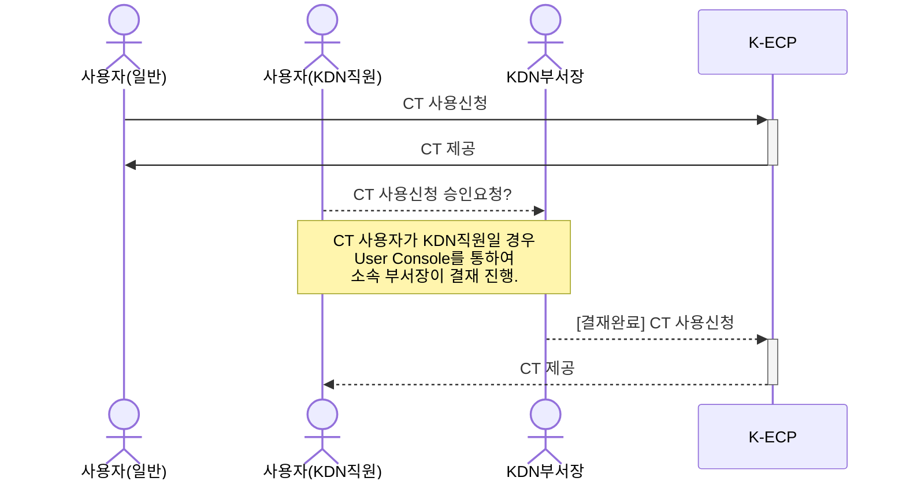

[문서 최종 수정일자 : 2023-05-05]: # 
[문서 최종 수정자 : 류정호]: # 

# Container Terminal 시작하기

이 안내서를 사용하여 K-ECP Container Terminal(이하. CT) 서비스를 시작 하십시오. CT의 서비스 신청서를 작성하고 연결하는 방법을 안내합니다. 

CT는 K-ECP에서 컨테이너를 관리하고 오케스트레이션 할 수 있는 터미널 입니다. CT에 접속하여 K-ECP OpenShift CLI인 `oc` 명령어와 Kubernetes 클러스터 작업을 위한 명령어인 `kubectl`를 사용하실 수 있습니다. 

### 관련 안내서

* Project 만들기
* SSL VPN 시작하기

### 목차

[개요](#abstract)

[전제 조건](#precondition)

[1단계: Container Terminal 서비스 신청](#step1)

[2단계: Container Terminal 접속](#step2)

[3단계: 주절의](#step3)

[다음 단계](#nextstep)

---

<span id="abstract"/>

## 개요

K-ECP CT 서비스를 사용하기 위해서는 아래와 같은 프로세스로 진행되며, KDN의 직원일 경우 User Console에서 소속 부서장의 결재가 필요합니다.



K-ECP CT는 User Console를 통해 신청한 후, 최종 승인 시 가상서버 형태로 제공 되며 SSL-VPN 또는 전용선(Direct Connect 서비스 사용시)을 이용하여 접속하실 수 있습니다.

  

CT 접속 후 CLI 명령어인 `oc`를 통해 Container Project를 위한 다음과 같은 다양한 작업을 수행할 수 있습니다.

* 프로젝트 소스 코드로 직접 작업
* K-ECP Container Platform 작업 스크립팅
* 애플리케이션 빌드, 배포 및 관리

---

<span id="precondition"/>

## 전제 조건

* 시작하기 전에 [K-ECP User Console](https://kecp.kdn.com/mbr/ "인터넷에서 접속 시")에 회원가입이 되어 있어야 합니다. 

* 사전에 CT를 신청할 프로젝트가 생성되어 있어야 합니다. 
  
  > :bulb: **Tip:** KDN 직원의 경우  KDN 내부망에서 [KDN 전용 User Console](http://kdnecp.kdn.com:8585/mbr/ "KDN 내부망에서 접속 시")로도 접속이 가능합니다.

---

<span id="step1"/>

## 1단계: Container Terminal 서비스 신청

1. K-ECP User Console에서   `[서비스 신청] 자원 > 컨테이너 신청 > Container Terminal 신청`의 돋보기 아이콘 클릭

2. 서비스 신청서 내역 작성 
   
   ```주절이
   주절이
   ```

3. ㄹㅇㄴㅁㄹㅇㅁㄴㄹ

4. ㄹㅇㄴㄹㄴㅇㅁㄹㅇ

5. ㄹㅇㄴㅁㄹㅇㄴㅁ

---

<span id="step2"/>

## 2단계: Container Terminal 서비스 신청

1. K-ECP User Console에서   `[서비스 신청] 자원 > 컨테이너 신청 > Container Terminal 신청`의 돋보기 아이콘 클릭

2. 서비스 신청서 내역 작성 
   
   ```주절이
   주절이
   ```

3. ㄹㅇㄴㅁㄹㅇㅁㄴㄹ

---

<span id="step3"/>

## 3단계: Container Terminal 서비스 신청

1. K-ECP User Console에서   `[서비스 신청] 자원 > 컨테이너 신청 > Container Terminal 신청`의 돋보기 아이콘 클릭

2. 서비스 신청서 내역 작성 
   
   ```주절이
   주절이
   ```

3. ㄹㅇㄴㅁㄹㅇㅁㄴㄹ

---

<span id="nextstep"/>

## 다음 단계

1. K-ECP User Console에서   `[서비스 신청] 자원 > 컨테이너 신청 > Container Terminal 신청`의 돋보기 아이콘 클릭

2. 서비스 신청서 내역 작성 
   
   ```
        주절이
   ```

3. ㄹㅇㄴㅁㄹㅇㅁㄴㄹ
