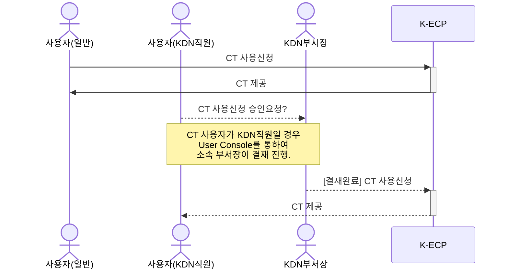

[문서 최종 수정일자 : 2023-05-19]: # 
[문서 최종 수정자 : 신승규]: # 

# Container Terminal 시작하기

이 안내서를 사용하여 **K-ECP Container Terminal(이하. CT)** 서비스를 시작 하십시오. CT의 서비스 신청서를 작성하고 연결하는 방법을 안내합니다. 

CT는 K-ECP에서 컨테이너를 관리하고 오케스트레이션 할 수 있는 터미널 입니다. CT에 접속하여 K-ECP OpenShift CLI인 `oc` 명령어와 Kubernetes 클러스터 작업을 위한 명령어인 `kubectl`를 사용하실 수 있습니다. 

### 관련 안내서

* [Project 만들기](./Project.md)
* [SSL VPN 시작하기](./SSLVPN_started.md)
* [Container 시작하기](./Container_started.md)

### 목차

[개요](#abstract)

[전제 조건](#precondition)

[1단계: Container Terminal 서비스 신청](#step1)

[2단계: Container Terminal 접속](#step2)

[3단계: OpenShift 로그인 및 CLI 사용](#step3)

[다음 단계](#nextstep)

---

<span id="abstract"/>

## 개요

K-ECP CT 서비스를 사용하기 위해서는 아래와 같은 프로세스로 진행되며, **KDN의 직원일 경우 User Console에서 소속 부서장의 결재**가 필요합니다.



K-ECP CT는 User Console를 통해 신청한 후 최종 승인 시 가상서버 형태로 제공 되며, 아래 개념도와 같이 **SSL-VPN 또는 전용선(Direct Connect 서비스 사용시)을 이용하여 접속**하실 수 있습니다.

  

CT 접속 후 CLI 명령어인 `oc`를 통해 Container Project를 위한 다음과 같은 다양한 작업을 수행할 수 있습니다.

* 프로젝트 소스 코드로 직접 작업
* K-ECP Container Platform 작업 스크립팅
* 애플리케이션 빌드, 배포 및 관리

---

<span id="precondition"/>

## 전제 조건

* 시작하기 전에 [K-ECP User Console](https://kecp.kdn.com/mbr/ "인터넷에서 접속 시")에 회원가입이 되어 있어야 합니다. 

* 사전에 CT를 신청할 프로젝트가 생성되어 있어야 합니다. 

> :bulb: **Tip:** KDN 직원의 경우  KDN 내부망에서 [KDN 전용 User Console](http://kdnecp.kdn.com:8585/mbr/ "KDN 내부망에서 접속 시")로도 접속이 가능합니다.

---

<span id="step1"/>

## 1단계: Container Terminal 서비스 신청

1. K-ECP User Console에서 `[서비스 신청] 자원 > 컨테이너 신청 > Container Terminal 신청`의 돋보기 아이콘:mag: 클릭

2. 서비스 신청서 내역 작성 
   
   > :bell: **안내:** CT는 VM Server 형태로 제공되며, 프로젝트 당 1개를 초과할 수 없습니다.
   
   * 프로젝트명: *CT가 포함되어야 될 기 생성완료된 프로젝트 선택*
   
   * 서버대역: *CT에 할당될 IP Subnet 대역 선택* 

3. `신청` 버튼을 클릭 하여 CT 서비스 신청 (단, KDN 직원일 경우 소속 부서장으로 결재자 지정 후 서비스 신청)

---

<span id="step2"/>

## 2단계: Container Terminal 접속

> :warning: **주의사항:** K-ECP SSL VPN이 사전에 신청되어 있어야 합니다.
> 
> :bulb:**안내**: [보안그룹 설정하기](./SecurityGroup_started.md)를 통해 vpn으로 부터 서버접 근이 허용되야 합니다.

1. CT 서비스 신청 승인이 완료 된 경우 K-ECP User Console에서 `서비스 현황 > 가상서버`로 이동하여 해당 프로젝트 선택

2. 선택된 프로젝트내에 VM Server형태로 생성된 CT의 **IP 주소 확인**

3. SSL VPN 연결 후 SSH 접속 툴 또는 커맨드을 통해 CT의 IP로 접속 (계정명: kecpuser, 초기 비밀번호: K-ECP 운영팀에게 문의)

**Windows에서 SSH로 접속하는 Command**

```powershell
ssh -p [SSH Port] kecpuser@[CT IP Address]
```

> :bell: **안내:** 최초 접속 시 비밀번호를 변경하셔야 정상접속 됩니다.

7. 비밀번호 입력 후 로그인
   
   ```
   kecpuser@[CT_IP] password:
   Activate the web console with: systemctl enable --now cockpit.socket
   
   This system is not registered to Red Hat Insights. See https://cloud.redhat.com/
   To register this system, run: insights-client --register
   
   Last login: Thu May 18 17:34:52 2023 from [IP]
   ```

> :bell: **안내:** 접속 후 초기 비밀번호 변경이 필요합니다.

---

<span id="step3"/>

## 3단계: OpenShift 로그인 및 CLI 사용

1. K-ECP 운영팀에게 OpenShift의 원하는 비밀번호 전달

> :bell:**안내**:원하는 비밀번호가 없는 경우 K-ECP 운영팀에서 임의로 설정합니다.

2. 접속한 CT서버에서 OpenShift 로그인

```
oc login -u [ID] https://api.ocp4.kdnecp.com:6443
```

```
Username: [ID]
Password:
Login successful.
```

3. Openshift 접속 확인

```
oc status  
```

```
In project SSG-TEST (ssg-test-del) on server https://api.ocp4.kdnecp.com:6443

http://ssgtest-ssg-test-del.apps.ocp4.kdnecp.com (svc/ssgtest)
  dc/ssgtest deploys istag/ssgtest:latest <-
    bc/ssgtest source builds http://[gitlab_URL]
    deployment #4 deployed 7 days ago - 1 pod
    deployment #3 deployed 7 days ago
    deployment #2 deployed 7 days ago
```

---

<span id ="next step"/>

</span>

## 다음 단계

* [Container Terminal 활용하기](./ContainerTerminal_use.md)를 통해서 `CT`서비스를 활용할 수 있습니다.(향후 제공 예정)
