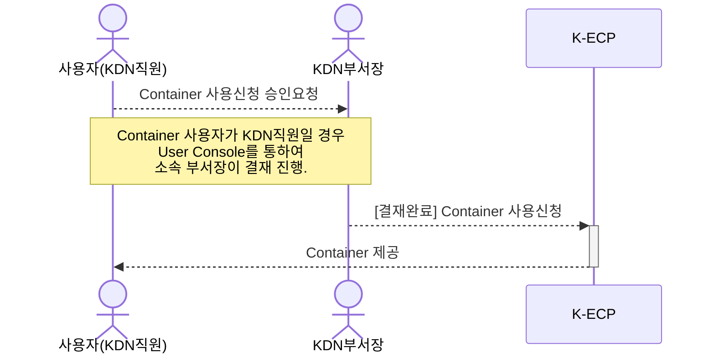

[문서 최종 수정일자]:#23.06.01

[문서 최종 수정자]:#신승규

# Container 시작하기

이 안내서를 사용하여 **Container** 서비스를 시작 하십시오. Container(PaaS)서비스를 사용하는 방법을 안내합니다.

Container는 소프트웨어 서비스를 실행하는 데 필요한 특정 버전의 프로그래밍 언어 런타임 및 라이브러리와 같은 종속 항목과 애플리케이션 코드를 함께 포함하는 경량 패키지입니다.

K-ECP의 Container서비스는 `ContainerTerminal`서비스와 함께 사용할 수 있습니다. CLI를 사용해 컨테이너 이미지를 컨테이너 레지스트리로 쉽게 전달할 수 있고, 이미지를 직접 운영 서버에 가져와 배포할 수 있어 개발부터 서비스 배포까지 필요한 작업을 간소화할 수 있습니다.

### 관련안내서

- [Container Terminal 시작하기](./ContainerTerminal_started.md)

- [Container Terminal 활용하기](./ContainerTerminal_use.md)

### 목차

[개요](#abstract)

[전제 조건](#precondition)

[0단계: K-ECP GitLab 가입하기](#step0)

[1단계: K-ECP GitLab프로젝트 및 리파지토리 생성](#step1)

[2단계: K-ECP GitLab에서 소스 업로드](#step2)

[3단계: 컨테이너 신청](#step3)

[다음단계](#nextstep)

---

<span id= "abstract"/>

## 개요

K-ECP Container서비스를 사용하기 위해서는 아래와 같은 프로세스로 진행됩니다.

* KDN 직원인 경우



* 일반 사용자인 경우


---

<span id= "prediction"/>

### 전제 조건

- [Project 만들기](./Project.md)를 통하여 Container 서비스를 신청할 프로젝트를 생성해야합니다.

- PC에 Git client가 설치되어 있어야 합니다.

> :bulb:**안내**: K-ECP SW자료실에서 다운로드 할 수 있습니다.

- [K-ECP SW 자료실](./http://10.100.11.114/k-ecp/software)에서 Git 파일 다운로드 후 설치(SSLVPN 접속상태에서 가능합니다.)

---

<span id= "step0"/>

# 0단계: GitLab가입하기

1. SSL-VPN 접속

2. GitLab URL접속: http://gitlab.ocp4.kdnecp.com

3. GitLab 화면에서 `Register Now`버튼 클릭
   
   * First name: 한글 성 입력
   
   * Last name: 한글 이름 입력
   
   * Username: 사번 입력
   
   * Email: 사용자 이메일 정보 입력 (config 등록시 필요)
   
   * Password: 사용자 패스워드 입력 (config 등록시 필요)

4. GitLab 가입 이후 해당 정보로 로그인
   
   * 원하는 역할(Role) 선택
  
     * Software Developer, Development Team Lead, Devops Engineer, Systems Administrator, Security Analyst, Data Analyst, Product Manager, Product Desinger, Other
   
   * `Get started!`버튼 클릭

---

## 1단계: GitLab 프로젝트 및 리파지토리 생성

1. 오른쪽 상단 배너에서 :heavy_plus_sign: > `New project/repository`클릭

2. `Create blank project` 클릭

3. `Create blank project` 상세 내역 작성
   
   * Project name: *프로젝트 이름 입력*
   
   * Project slug: *Project name 입력 시 자동입력 (URL의 구체적인 내용)*
   
   * Visibility Level : *`Public` 선택*
   
   > :warning:**주의**: 반드시 **Public**으로 선택해야 합니다.

   * initialize repository with a README : *체크를 통해 이후 README 파일 생성을 확인할 수 있음*

4. `Create Project`버튼 클릭

5. 생성된 Project 정보 확인후 `Clone`버튼 클릭

6. `Clone`드롭다운 메뉴내에서 `Clone with HTTP`의 URL 복사

> :bulb:**안내**: URL 주소는 복사 후 별도 저장이 필요합니다.

---

## 2단계: GitLab에서 소스 업로드

1. 로컬 PC에 workplace 폴더 생성 (workplace 폴더명은 임의 지정)

2. 생성된 폴더 우클릭 후 `Git Bash Here` 선택

3. 1단계에서 복사한 URL주소를 입력하여 Clone 실행
   
   ```powershell
   git clone [Clone with Http]
   ```

4. 이후 디렉토리에 프로젝트명(`Project name`)의 폴더가 생성되었는지 확인 후 해당 폴더로 이동

5. README.md 파일 확인

6. 배포하려는 파일을 생성된 폴더(`Project name`)로 이동

7. 배포하려는 파일명을 `ROOT.war`로 수정

8. 실행중인 Git Bash 창에서 생성된 폴더로 이동
   
   ```powershell
   cd [Project name]
   ```

9. 해당 리파지토리에 유저 정보 등록(0. K-ECP Gitlab 가입시 작성한 사번과 Email 등록)
   
   ```powershell
   git config --global user.name"[사번]"
   ```
   
   ```powershell
   git config --global user.email"[User Email]"
   ```

10. 등록된 정보 확인
    
    ```powershell
    git config --list | grep user.
    ```

11. GitLab에 소스 업로드
    
    * 현재 디렉토리의 모든 소스를 로컬 디렉토리에 추가
      
      ```powershell
      git add .
      ```
    
    * GitLab으로 commit
      
      ```powershell
      git commit -m "commit 메시지"
      ```
    
    * 로컬 소스를 Git(Main Branch로)에 업로드
      
      ```powershell
      git push -u origin main
      ```

---

## 3단계: 컨테이너 신청

1. GitLab에서 업로드된 소스를 확인

2. `Clone with HTTP`의 git 주소 복사

3. K-ECP User Console에서 `[서비스 신청] 자원 > 컨테이너 신청`으로 이동
   
   * WAS, HTTP, KDN Python Django 기반 어플리케이션 중 선택하여 돋보기:mag:아이콘 클릭

4. 컨테이너 신청 상세 내역 작성
   
   * 프로젝트명 : *컨테이너를 신청할 프로젝트 선택*
   
   * 서버대역: *컨테이너를 신청할 클러스터 선택*
   
   * 어플리케이션 명: *사용자가 어플리케이션 명 임의 지정*
   
   * 버전: *배포할 컨테이너의 표준 템플릿 지정(Base OS + 설치된 Libarary)*
   
   * Git URL 주소: *2.에서 복사한 git 주소 입력*
   
   * 서버사양: *원하는 서버 사양 선택*
   
   * 컨테이너 수: *생성할 컨테이너 수 지정*
   
   * 기타사항: *컨테이너 관련 추가 요청사항 작성*

5. `신청`버튼 클릭

---
<span id ="step4"/>
## 4단계 : Contanier 확인

1. ㅊ

---

<span id="nextstep"/>

</span>

# 다음단계

* [Container Terminal 시작하기](./ContainerTerminal_started.md)를 통하여 `Container`를 관리할 수 있습니다.
