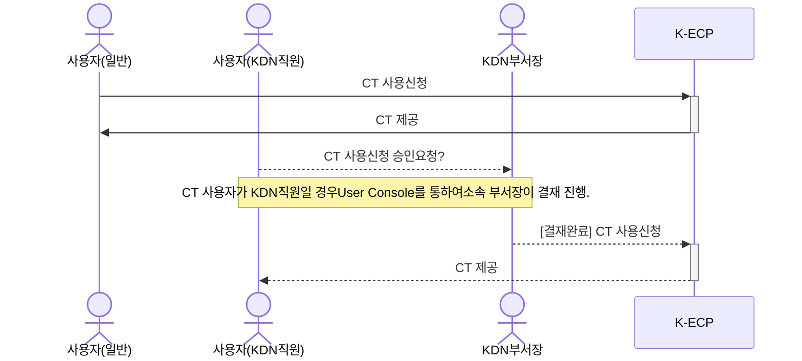

[문서 최종 수정일자]:#23.06.01

[문서 최종 수정자]:#신승규

# Container 시작하기

이 안내서를 사용하여 **Container**를 시작 하십시오. Container(PaaS)서비스를 사용하는 방법을 안내합니다.

Container는 소프트웨어 서비스를 실행하는 데 필요한 특정 버전의 프로그래밍 언어 런타임 및 라이브러리와 같은 종속 항목과 애플리케이션 코드를 함께 포함하는 경량 패키지입니다.

### 관련안내서

- [VM 시작하기]([https://kecp-kdn.com/](https://kecp-kdn.com/) "VM 시작하기)

- [CT 시작하기](https://kecp-kdn.com/ "CT 시작하기")

### 목차

[개요](#abstract)

[전제 조건](#precondition)

[1단계](#step1)

[2단계](#step2)

[다음단계](#nextstep)

---

## 개요

K-ECP `SG` 서비스를 사용하기 위해서는 아래와 같은 프로세스로 진행됩니다.

---

### 전제 조건

- [VM 시작하기](https://kecp-kdn.com/ "VM 시작하기")를 통하여서 User Console에서 VM을 할당 받아야 합니다.

- [SSL VPN](https://kecp-kdn.com/ "SSL_VPN 시작하기")를 통해 해당 VM으로 접근 가능해야 합니다.

---

## 1단계: Security Group 서비스 사용

1. K-ECP User Console에 로그인
2. K-ECP User Console에서 `서비스 현황 > 가상서버`이동 후 `SG`서비스를 사용할 VM이 속한 프로젝트의 돋보기 아이콘:mag:클릭
3. `SG`서비스를 사용할 VM의 `호스트명`과 `IP 주소`를 확인한 후 해당 VM의 보안그룹 돋보기 아이콘:mag:클릭
4. 보안그룹의 작업 돋보기 아이콘:mag:클릭

---

## 2단계: Security Group 서비스 설정

1. `규칙추가`버튼 클릭
   
   - 설명: 보안그룹 설명 추가
   
   - 트래픽 방향: 인바운드/아웃바운드 선택
   
   - 포트 구분
     
     - 포트범위: 해당 범위의 포트를 허용합니다.
     
     - 모든포트: 모든포트에서 허용합니다.
     
     - 포트: 해당 포트에서 허용합니다.
   
   - 원격지IP: 원격지IP 표기

> :bell:**안내**: SSL VPN IP를 입력합니다.

- Ether 타입: IPv4, IPv6 선택

- `확인`버튼 클릭
  
  2. 이후 `트래픽 방향`, `Ether 타입`, `IP 프로토콜`, `원격지IP`, `포트 범위min`, `포트 범위max`, `설명`을 통하여 보안그룹 규칙을 확인할 수 있습니다.
3. `삭제`버튼을 클릭하여 보안그룹 규칙을 삭제할 수 있습니다.

---

## 다음단계

- `SG`서비스를 통해 `VM`서버를 관리할 수 있습니다.
