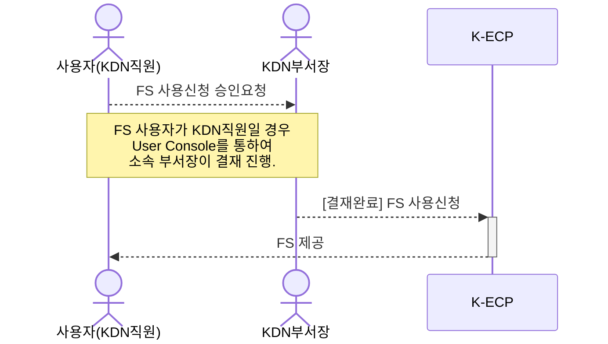
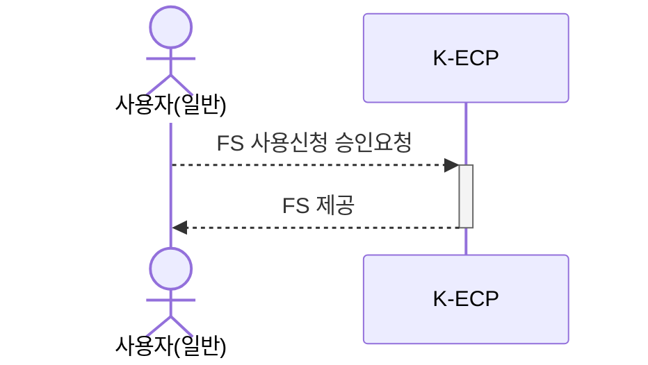
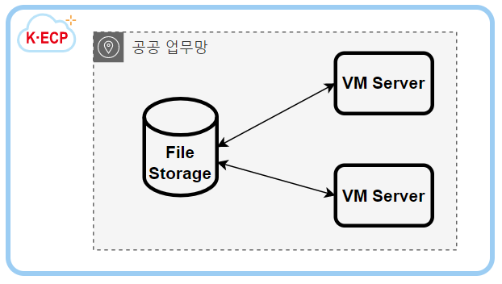

[문서 최종 수정일자 : 2023-07-28]: # 

[문서 최종 수정자 : 신승규]: #  

# File Storage 시작하기

이 안내서를 사용하여 **K-ECP File Storage(이하. FS)** 서비스를 시작 하십시오. FS 서비스 신청서를 작성하고 연결하는 방법을 안내합니다.

FS는 파일과 폴더의 계층구조로 저장됩니다. FS에서는 데이터가 폴더 안에 단일 정보로 저장됩니다. 해당 데이터를 찾기 위해 경로를 알아야 합니다.

### 관련 안내서

* [Project 만들기](./Project.md)
* [VM Server 시작하기](./SSLVPN_started.md)

### 목차

[개요](#abstract)

[전제 조건](#precondition)

[1단계: File Storage 서비스 신청](#step1)

[2단계: File Storage 마운트](#step2)

[3단계: File Storage 자동 마운트](#step3)

[다음 단계](#nextstep)

---

<span id="abstract"/>

## 개요

K-ECP FS 서비스를 사용하기 위해서는 아래와 같은 프로세스로 진행되며, **KDN의 직원일 경우 User Console에서 소속 부서장의 결재**가 필요합니다.

* KDN 직원이 사용할 경우



* 일반 사용자



K-ECP FS는 User Console를 통해 신청한 후 최종 승인 시 제공 되며, 아래 개념도와 같이 VM Server에서 마운트하여 접속하실 수 있습니다. 또한 2대 이상의 VM Server가 1개의 FS를 공유하여 사용할 수 있습니다.



<span id="precondition"/>

## 전제 조건

* 사전에 FS를 할당 받을 VM서비스가 신청되어 있어야 합니다.
  
* 사전에 [SSL VPN시작하기](./SSLVPN_started.md)를 통해서 SSL VPN이 신청되어 있어야 합니다.

> :bulb: **Tip:** KDN 직원의 경우  KDN 내부망에서 [KDN 전용 User Console](http://kdnecp.kdn.com:8585/mbr/ "KDN 내부망에서 접속 시")로도 접속이 가능합니다.

---

<span id="step1"/>

## 1단계: File Storage 서비스 신청

1. K-ECP User Console에서 `[서비스 신청] 자원 > 스토리지 신청 > 파일 스토리지`의 돋보기 아이콘:mag: 클릭

2. 서비스 신청서 내역 작성 
   
   * 클라우드: *FS 서비스를 할당받을 가상서버가 있는 클라우드 선택*
   
   * 프로젝트명: *FS가 포함되어야 될 기 생성완료된 프로젝트 선택*
   
   * 가상서버: *FS가 할당될 VM Server 선택* 
   
   * 스토리지명: *사용자가 식별할 수 있는 스토리지명 작성*
   
   * 디스크 크기: *(최소 10GB, 최대 500GB)원하는 디스크 크기 설정*
   
   * 스토리지ID: *서버에서 마운트 시킬 스토리지경로명 작성*

3. `신청` 버튼을 클릭 하여 FS 서비스 신청 (단, KDN 직원일 경우 소속 부서장으로 결재자 지정 후 서비스 신청)

---

<span id="step2"/>

## 2단계: File Storage 마운트

> :warning: **주의사항:** VM 서비스가 사전에 신청되어 있어야 합니다.

1. FS 서비스 신청 승인이 완료 된 경우 K-ECP User Console에서 `서비스 현황 > 스토리지`로 이동

2. 해당 FS 서비스를 신청한 프로젝트 상세의 돋보기 아이콘:mag: 클릭

3. 파일스토리지 목록에서 신청한 스토리지ID와 스토리지명을 확인

4. 해당 FS의 파일경로 확인

5. FS를 신청한 VM Server로 접속, SSH 클라이언트(Putty, Windows 터미널 등)을 통해 서버 접속
   
   - 본 가이드에서는 윈도우 명령 프롬프트(터미널)을 이용한 SSH 접속
     
   ```powershell
   ssh -p [ssh Port] kecpuser@[VM_IP_address]
   ```

6. 현재 디스크 상태 확인
   
```bash
df -h
```
   
   * 기본 OS 디스크만 마운트 되어 있는 것을 확인
     
   ```
   Filesystem      Size  Used Avail Use% Mounted on
   devtmpfs        1.8G     0  1.8G   0% /dev
   tmpfs           1.9G     0  1.9G   0% /dev/shm
   tmpfs           1.9G   25M  1.8G   2% /run
   tmpfs           1.9G     0  1.9G   0% /sys/fs/cgroup
   /dev/vda3        50G  7.5G   43G  15% /
   /dev/vda2       100M  5.8M   95M   6% /boot/efi
   tmpfs           374M     0  374M   0% /run/user/1001
   ```

7. 파일 시스템을 파티셔닝하고 마운트하는 작업으로 root 권한으로 작업하여야 합니다.
   
```bash
sudo -i
```

8. FS를 마운트할 디렉토리 생성(본 가이드에서는 디렉토리명을 `/FS_data` 로 진행, 사용자가 원하는 디렉토리명으로 변경하여 사용)
   
```bash
mkdir /FS_data
```

9. 3., 4. 에서 확인한 파일경로를 통해 FS 마운트
   
```bash
mount -t nfs [FS_IP]:/[스토리지ID] /FS_data
```

> :bulb:**안내**: FS_IP의 경우 K-ECP 운영팀에 문의해야 합니다.

9. 마운트가 잘 되었는지 확인
   
```bash
df -h
```
   
```
Filesystem                 Size  Used Avail Use% Mounted on
devtmpfs                   1.8G     0  1.8G   0% /dev
tmpfs                      1.9G     0  1.9G   0% /dev/shm
tmpfs                      1.9G   25M  1.8G   2% /run
tmpfs                      1.9G     0  1.9G   0% /sys/fs/cgroup
/dev/vda3                   50G  7.5G   43G  15% /
/dev/vda2                  100M  5.8M   95M   6% /boot/efi
tmpfs                      374M     0  374M   0% /run/user/1001
[FS_IP]:/[스토리지ID]        10G     0   10G   0% /FS_data
```

---

<span id="step3"/>

## 3단계: File Storage 자동 마운트

> :bulb:**안내**: 자동 마운트를 설정하지 않으면, 부팅할 때마다 디스크를 마운트 해야하기 때문에 자동마운트 설정을 실행합니다.

> :warning:**주의사항**: hosts, fstab 파일 수정하는 작업은 root 권한으로 실행해야 합니다.

```bash
sudo -i
```

1. hosts 파일 수정을 통한 FS_IP 를 논리 주소로 변경
   
```bash
vi /etc/hosts
```
   
   * [FS_IP]를 filestorage라는 논리주소로 설정
     
   ```
   127.0.0.1   localhost localhost.localdomain localhost4 localhost4.localdomain4
   ::1         localhost localhost.localdomain localhost6 localhost6.localdomain6
   [FS_IP]  filestorage
   ```
2. vi 편집기로 fstab 파일 수정
   
```bash
vi /etc/fstab
```
   
   * 자동 마운트 내용 추가(UUID = ...) (1.에서 확인한 UUID 입력)
     
     > :bulb:**안내**: vi 편집기 실행 후 **"i"** 키를 눌러 편집을 실행할 수 있습니다. 이후 **"ESC"** , **":wq"** 입력을 통해 편집 내용을 저장할 수 있습니다.
     
   ```
   UUID=d47ead13-ec24-428e-9175-46aefa764b26       /       xfs     defaults        0       0
   UUID=7B77-95E7  /boot/efi       vfat          defaults,uid=0,gid=0,umask=077,shortname=winnt  0       2
   filestorage:/[스토리지ID] /FS_data                  nfs           nosuid,rw,sync,hard,intr        0 0
   ```

3. 자동 마운트 설정내역 테스트
   
   * /data umount
     
   ```bash
   umount /FS_data
   ```
   
   * umount 확인
     
   ```bash
   df -h
   ```
     
   ```
   devtmpfs        1.8G     0  1.8G   0% /dev
   tmpfs           1.9G   84K  1.9G   1% /dev/shm
   mpfs           1.9G   25M  1.8G   2% /run
   tmpfs           1.9G     0  1.9G   0% /sys/fs/cgroup
   /dev/vda3        50G  7.5G   43G  15% /
   /dev/vda2       100M  5.8M   95M   6% /boot/efi
   tmpfs           374M  8.0K  374M   1% /run/user/1001
   ```
   
   * 전체 마운트 명령
     
   ```bash
   mount -a
   ```
   
   * 자동 마운트 확인
     
   ```bash
   df -h
   ```
     
   ```
   Filesystem               Size  Used Avail Use% Mounted on
   devtmpfs                 1.8G     0  1.8G   0% /dev
   tmpfs                    1.9G   84K  1.9G   1% /dev/shm
   tmpfs                    1.9G   25M  1.8G   2% /run
   tmpfs                    1.9G     0  1.9G   0% /sys/fs/cgroup
   /dev/vda3                 50G  7.5G   43G  15% /
   /dev/vda2                100M  5.8M   95M   6% /boot/efi
   tmpfs                    374M  8.0K  374M   1% /run/user/1001
   filestorage:/[스토리지ID]  10G     0   10G   0% /FS_data
   ```

---

<span id ="next step"/>

</span>

## 다음 단계

* File Storage 삭제하기를 통해서 VM에 할당된 FS를 삭제할 수 있습니다.
