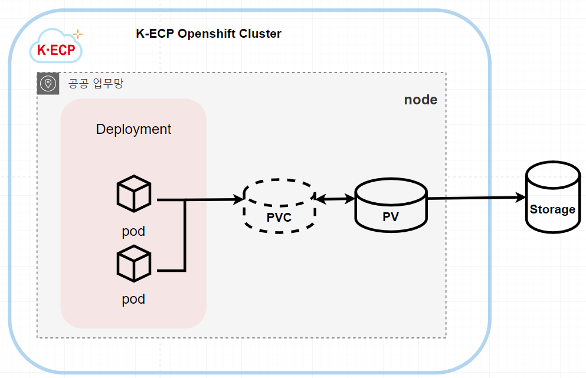
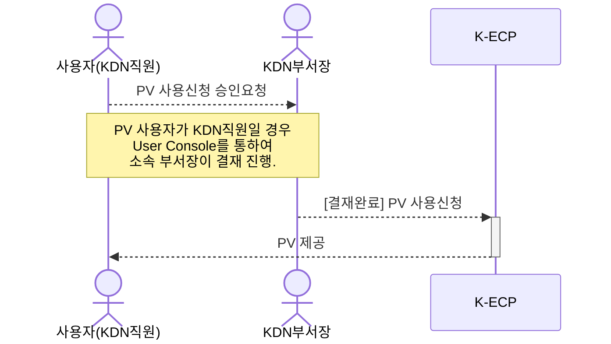
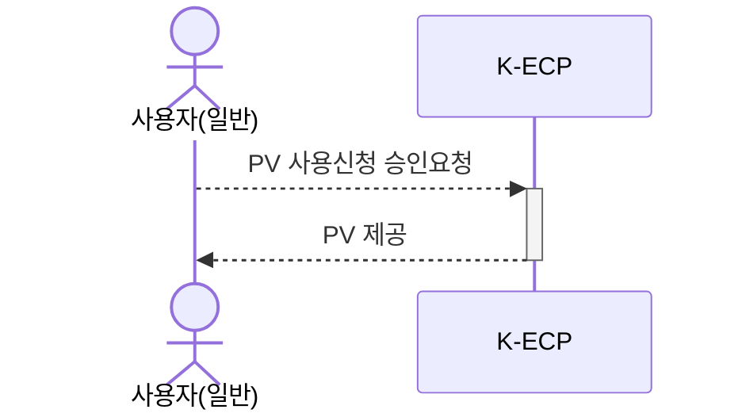
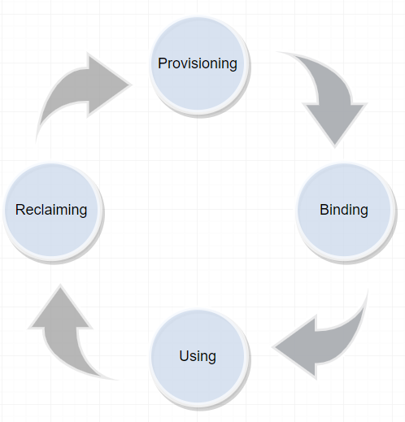

[문서 최종 수정일자 : 2023-08-02]: # 

[문서 최종 수정자 : 신승규]: #

# PV 시작하기

이 안내서를 사용하여 **K-ECP Persistent Volume (이하. PV)** 서비스를 시작 하십시오. PV 서비스를 사용하는 방법을 안내합니다.

PV는 아래의 그림과 같이 PV와 PVC로 구성되어 Pod에 스토리지를 제공합니다.



### 관련안내서

- [Container Terminal 시작하기](./ContainerTerminal_started.md)

- [CT 활용하기#1](./CT_use1.md)

### 목차

[개요](#abstract)

[전제 조건](#precondition)

[1단계: K-ECP PV신청하기](#step1)

[2단계: PVC 확인하기](#step2)

[3단계: PVC를 해당 Pod에 마운트하기](#step3)

[다음단계](#nextstep)

---

<span id= "abstract"/>

## 개요

K-ECP PV서비스를 사용하기 위해서는 아래와 같은 프로세스로 진행됩니다.

* KDN 직원이 사용할 경우



* 일반 사용자



PV와 PVC는 다음과 같은 생명주기가 있습니다.



1. Provisioning(프로비저닝): PV를 만드는 단계를 프로비저닝(Provisioning)이라고 합니다. 

2. Binding(바인딩):바인딩(Binding)은 프로비저닝으로 만든 PV를 PVC와 연결하는 단계입니다.

3. Using(사용): PVC는 파드에 설정되고 파드는 PVC를 볼륨으로 인식해서 사용합니다.

4. Reclaiming(반환): 사용이 끝난 PVC는 삭제되고 PVC를 사용하던 PV를 초기화(reclaim)하는 과정입니다.

---

<span id= "prediction"/>

### 전제 조건

- [Container 시작하기](./Container_started.md), 또는 [Container Terminal시작하기](./ContainerTerminal_started.md)를 통하여 PV 서비스를 신청할 Container가 있어야합니다.

- [Container Terminal시작하기](./ContainerTerminal_started.md)를 통하여 PV를 설정할 수 있는 CT서비스가 신청되어 있어야 합니다.

---

<span id= "step1"/>

## 1단계: K-ECP PV신청하기

1. K-ECP User Console에서 `[서비스 신청] 자원 > 스토리지 신청`으로 이동

2. `컨테이너용 파일 스토리지`의 돋보기 아이콘:mag: 클릭

3. `컨테이너용 파일 스토리지` 상세 내역 작성
   
   * 클라우드: *Open PaaS 클러스터 선택*
   
   * 프로젝트명: *PV를 신청할 프로젝트를 선택*
   
   * 스토리지명: *사용자가 PV를 식별할 수 있는 스토리지명 작성*
   
   * 디스크 크기: *사용자가 원하는 PV의 크기를 설정(최소 10GB, 최대 500GB)*
   
   * 스토리지ID: *체크를 통해 이후 README 파일 생성을 확인할 수 있음*

4. `신청` 버튼을 클릭 하여 PV 서비스 신청 (단, KDN 직원일 경우 소속 부서장으로 결재자 지정 후 서비스 신청)

---

<span id= "step2"/>

## 2단계: PVC 확인하기

1. K-ECP User Console에서 `서비스 현황 > 스토리지`로 이동

2. PV 서비스를 신청한 프로젝트의 돋보기 아이콘:mag: 클릭

3. NAS 필드에서 신청한 스토리지ID와 스토리지명의 PV가 존재하는지 확인

4. [ContainerTerminal 시작하기](./mdfile/ContainerTerminal_started.md)를 통해 CT서버에 접속 후 OpenShift계정 로그인

5. PVC 상태 확인

```bash
oc get pvc
```

* STATUS 가 BOUND 상태임을 확인

```
NAME            STATUS   VOLUME    CAPACITY   ACCESS MODES   STORAGECLASS   AGE
edupv1-claim    Bound    edupv1    10Gi       RWX                           17d
```

---

<span id= "step3"/>

## 3단계: PVC를 해당 Pod에 마운트하기

1. 

---

<span id="nextstep"/>

</span>

# 다음단계

* [Container Terminal 시작하기](./ContainerTerminal_started.md)를 통하여 `Container`를 관리할 수 있습니다.
