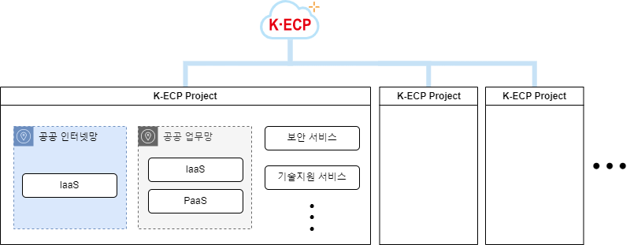
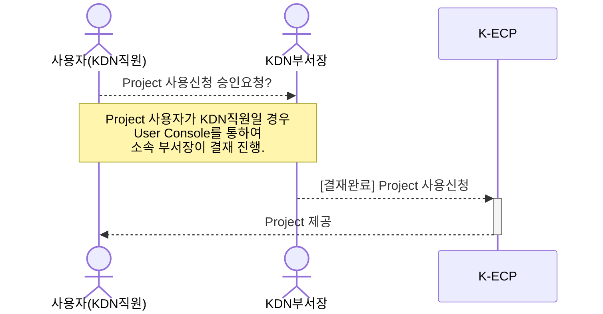
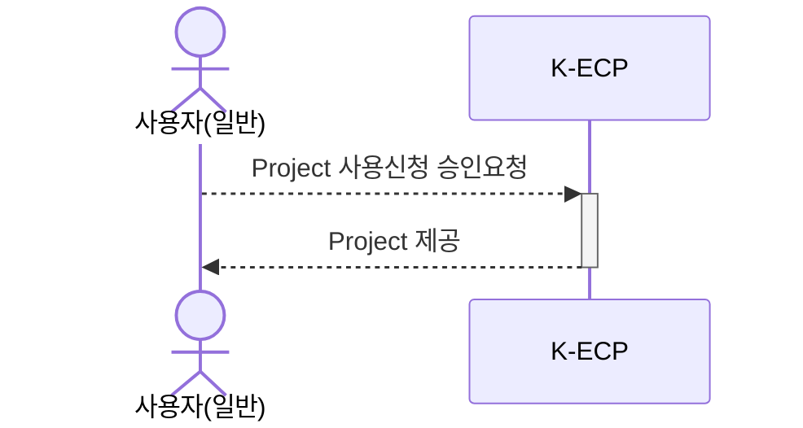

[문서 최종 수정일자 : 2023-07-27]: # 
[문서 최종 수정자 : 신승규]: #

# Project 만들기

이 안내서를 사용하여 K-ECP의 **Project**를 시작 하십시오. Project 신청서를 작성하고 시작하는 방법을 안내합니다.

Project는 K-ECP에서 업무 시스템을 의미하며, 프로젝트 신청 이후 다양한 서비스(자원, 기술지원, 시스템SW)를 사용할 수 있습니다. 프로젝트별 설정된 쿼터(Quota)에서만 서비스(자원, 기술지원, 시스템SW)을 생성할 수 있으며 생성된 서비스(자원, 기술지원, 시스템SW)은 논리적으로 완벽히 분리되어 운영됩니다.
아래의 그림과 같이 Project안에서 서비스를 구성하여 K-ECP 서비스를 사용할 수 있습니다.

### 관련 안내서

- [VM Server 시작하기](./VirutalMachine_started.md)
- [Container Service 시작하기](./Container_started.md)
- [SSL VPN 시작하기](./SSLVPN_started.md)

### 목차

[개요](#abstract)

[전제 조건](#precondition)

[1단계: Project 신청](#step1)

[2단계: Project 사용](#step2)

[다음 단계](#nextstep)

---

## 개요

K-ECP Project 서비스를 사용하기 위해서는 아래와 같은 프로세스로 진행되며, **KDN의 직원일 경우 User Console에서 소속 부서장의 결재**가 필요합니다.

* KDN 직원인 경우

* 일반 사용자인 경우

위 그림의 진행방식과 같이 K-ECP Project는 User Console를 통해 신청한 후 최종 승인 시 사용 가능합니다.

---

## 전제 조건

- 시작하기 전에 [K-ECP User Console](https://kecp.kdn.com/mbr/ "인터넷에서 접속 시")에 회원가입이 되어 있어야 합니다.

> :bulb: **Tip:** KDN 직원의 경우 KDN 내부망에서 [KDN 전용 User Console](http://kdnecp.kdn.com:8585/mbr/ "KDN 내부망에서 접속 시")로도 접속이 가능합니다.

---

## 1단계: Project 서비스 신청

1. K-ECP User Console에서 `프로젝트 > 프로젝트 현황(신청)`에서:heavy_check_mark:`승인의뢰`버튼을 클릭

> :bulb:**Tip**: `프로젝트 현황(신청)`페이지에서 현재 부서에서 관리하는 모든 Project 목록을 확인할 수 있습니다.

2. Project 신청서 내역 작성
   
   * 프로젝트명: *신청할 Project 이름 입력*
   
   * 내용: *프로젝트 상세 내용 입력*
   
   * 회원사/담당조직(부서)/신청자: *로그인한 사용자의 계정을 통해 자동 입력*
   
   * 사용 가능 클러스터: 신청할 Project가 사용 가능한 클라우드 인프라 자원 표시

3. `신청`버튼 클릭

> :bulb:**Tip**:`임시저장` 버튼을 통해 Project 신청 내역을 임시저장할 수 있습니다.

4. 요청부서 결재자 지정을 위해 :mag:버튼 클릭

5. 결재자 지정 후 `확인`버튼 클릭

6. 신청확인화면을 통해서 Project 신청 내역 확인 후 `확인`버튼 클릭

---

## 2단계: Project 사용

1. Project 신청 승인이 완료 된 경우 K-ECP User Console에서 `신청 현황 > 프로젝트`에서 부서에서 신청하거나 했던 Project 목록이 표시됩니다.

2. Project를 선택하면 해당 Project에 대한 승인 프로세스 정보와Project 신청 시 입력한 Project 신청 정보를 확인할 수 있습니다.

3. 이후 `[서비스 신청]`시 Project선택 항목에서 사용자가 원하는 Project를 선택하여 해당 Project에서 서비스를 구성하여 사용할 수 있습니다.

---

## 다음 단계

- [VM Server 시작하기](./VirtualMachine_started.md)를 통해 Project에서 `VM`서비스를 시작할 수 있습니다.

- [Container 시작하기](./Container_started.md)를 통해 Project에서 `Container`서비스를 시작할 수 있습니다.
