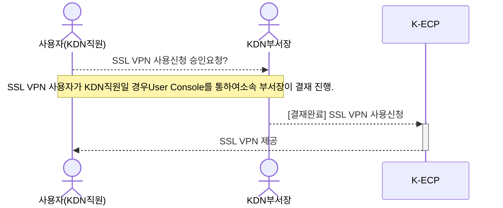
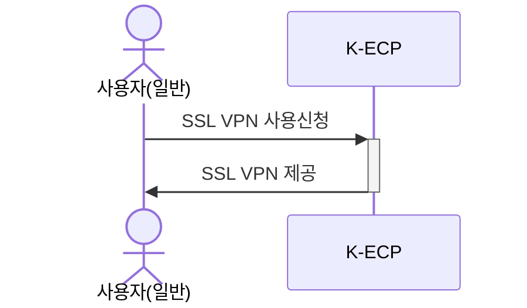
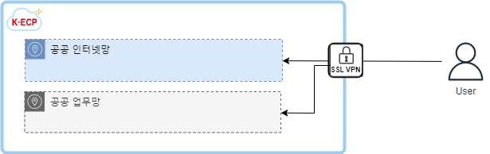

# SSL VPN 시작하기

이 안내서를 사용하여 **K-ECP SSL VPN** 서비스를 시작 하십시오. SSL VPN의 서비스 신청서를 작성하고 시작하는 방법을 안내합니다.

VPN은 원격지에서 인터넷을 사용하여 기업 내부의 정보시스템을 안전하게 사용할 수 있도록 SSL 프로토콜, 암호화 기술, 터널링 기술, 프록시 기술 등을 적용해 안전한 통신 채널을 제공하는 기술을 말합니다.

SSL VPN(Secure Sockets Layer VPN)은 컴퓨터 네트워크에 통신 보안을 제공하기 위해 설계된 암호 규약입니다. SSL규약은 인터넷 같이 TCP/IP 네트워크를 사용하는 통신에 적용되며, 통신 과정에서 전송계층 종단 간 보안과 데이터 무결성을 확보해줍니다.

### 관련 안내서

- [VM Sever 시작하기](./VirtualMachine_started.md)
- [Security Group 시작하기](./SecurityGroup_started.md)

### 목차

[개요](#abstract)

[전제 조건](#precondition)

[1단계: SSL VPN 서비스 신청](#step1)

[2단계: SSL VPN 접속](#step2)

[3단계: SSL VPN 사용](#step3)

[다음 단계](#nextstep)

---

## 개요

K-ECP SSL VPN서비스를 사용하기 위해서는 아래와 같은 프로세스로 진행되며, **KDN의 직원일 경우 User Console에서 소속 부서장의 결재**가 필요합니다.

*KDN 사용자의 경우

* 일반 사용자의 경우

K-ECP SSL VPN은 User Console를 통해 신청한 후 최종 승인 시 사용 가능합니다. 아래 개념도와 같이 **SSL-VPN을 통해서 K-ECP의 서비스**에 접속하실 수 있습니다. 접속 가능 영역으로는 공공 인터넷 영역(DMZ)와 공공 업무망 영역이 있습니다.(공공 업무망의 경우 방화벽 정책 필요)

---

## 전제 조건

- 시작하기 전에 [K-ECP User Console](https://kecp.kdn.com/mbr/ "인터넷에서 접속 시")에 회원가입이 되어 있어야 합니다.

- 사전에 SSL VPN을 신청할 프로젝트가 생성되어 있어야 합니다.

> :bulb: **Tip:** KDN 직원의 경우 KDN 내부망에서 [KDN 전용 User Console](http://kdnecp.kdn.com:8585/mbr/ "KDN 내부망에서 접속 시")로도 접속이 가능합니다.

---

## 1단계: SSL VPN 서비스 신청

1. K-ECP User Console에서 `[서비스 신청] 기술지원 > 네트워크 신청`에서 `SSL VPN 서비스 신청`의 돋보기:mag:아이콘 클릭

2. SSL VPN 신청 내역 작성
   
   * 클러스터:*DMZ, Open IaaS, Open PaaS, 사용 IaaS, Naver cloud Platform*중 선택
   
   > :bulb:**안내**: 접속해야하는 해당 접속대상서버의 클러스터를 선택
   
   * 프로젝트명: *해당 Project명 검색 후 선택*

3. 추가 요청사항:*접속대상서버의 IP 입력*

> :bulb:**안내**: 접속대상서버의 IP는 `서비스 현황 > 가상서버`에서 확인 가능합니다.

1. :heavy_check_mark:`신청` 버튼 클릭

---

## 2단계: SSL VPN 접속

> :warning:**주의사항**: 인터넷 접속 가능한 PC에서 실행해야 합니다.

1. 웹 브라우저 주소창에 VPN 접속 주소 입력

> :bulb:**안내**: VPN URL: https://kecp-vpn.kdn.com

2. 최초 VPN 접속 후 `인증센터` 버튼 클릭, `클라이언트 다운로드`버튼 클릭

3. 아이디 / 패스워드 입력 후 `인증번호 발송`버튼 클릭

> :bulb:**안내**: 최초 아이디/패스워드는 사번/OOOO 입니다.(최초 비밀번호의 경우 운영팀에 문의)

4. 핸드폰 문자 인증 후 로그인

5. 인증서 발급화면에서 인증서 비밀번호 설정 후 `발급`버튼 클릭

6. VPN 접속 주소를 통해 재접속 후 다시 로그인

7. 인증서 선택화면에서 `공급자`>`KECPVPN`인 인증서 선택 후 본인이 설정한 비밀번호 입력 `확인`버튼 클릭

---

## 3단계: SSL VPN 확인

1. 윈도우 작업표시줄에서 숨겨진 아이콘 표시 클릭

2. `SecuwaySSLU`앱에 마우스커서 이동

3. `Assigned IP: [IP]` [IP]를 통해서 SSLVPN IP확인

---

## 다음 단계

- [Security Group 시작하기](./SecurityGroup_started.md)를 통해 SSL VPN에 접근하는 사용자에 대한 보안 정책을 설정할 수 있습니다.
