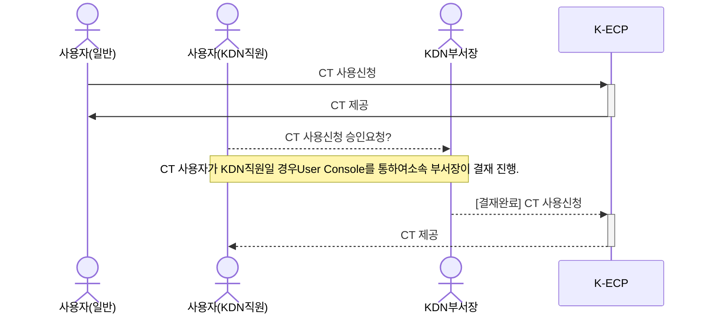

[문서 최종 수정일자]:#23.05.23

[문서 최종 수정자]:#신승규

# 보안그룹 설정 시작하기

이 안내서를 사용하여 **K-ECP Security Group(이하. SG)*** 서비스를 시작 하십시오. `SG`의 서비스를 사용하는 방법을 안내합니다.

`SG`를 통하여 클라우드 상의 가상서버의 송수신 트래픽을 제어하여 해당 서버를 보호하는 가상의 논리적 방화벽 입니다. SG는 `프로토콜, IP, 포트`와 `트래픽 방향(인바운드/아웃바운드)`을 설정하여 서버의 접근을 제어합니다.

### 관련안내서

* [VM 시작하기](./VirtualMachine_started.md)

* [CT 시작하기](./ContainerTerminal_started.md)

### 목차

[개요](#abstract)

[전제 조건](#precondition)

[1단계](#step1)

[2단계](#step2)

[다음단계](#nextstep)

---

## 개요

K-ECP의 SG 서비스를 사용하기 위해서는 아래와 같은 프로세스로 진행됩니다.

K-ECP의 SG서비스를 통해서 VPN을 통하여 서버로 접근하는 사용자 중 **인가된 사용자**만 

> :warning:**주의사항**: K-ECP의 SG는 Instance 당 1개의 그룹만 제공합니다. 보안그룹 내에서 여러개의 인/아웃바운드 규칙을 적용하여 트래픽을 제어할 수 있습니다.

---

### 전제 조건

- [VM 시작하기](./VirtualMachine_started.md)를 통하여서 User Console에서 VM을 할당 받아야 합니다.

- [SSL VPN](./SSLVPN_started.md)를 통해 해당 VM으로 접근 가능해야 합니다.

---

## 1단계: Security Group 서비스 사용

1. K-ECP User Console에 로그인
2. K-ECP User Console에서 `서비스 현황 > 가상서버`이동 후 `SG`서비스를 사용할 VM이 속한 프로젝트의 돋보기 아이콘:mag:클릭
3. `SG`서비스를 사용할 VM의 `호스트명`과 `IP 주소`를 확인한 후 해당 VM의 보안그룹 돋보기 아이콘:mag:클릭
4. 보안그룹의 작업 돋보기 아이콘:mag:클릭

---

## 2단계: Security Group 서비스 설정

1. `규칙추가`버튼 클릭
   
   - 설명: 보안그룹 설명 추가
   
   - 트래픽 방향: 인바운드/아웃바운드 선택
   
   - 포트 구분
     
     - 포트범위: 해당 범위의 포트를 허용합니다.
     
     - 모든포트: 모든포트에서 허용합니다.
     
     - 포트: 해당 포트에서 허용합니다.
   
   - 원격지IP: 원격지IP 표기
   
   > :bell:**안내**: SSL VPN IP를 입력합니다.
   
   - Ether 타입: IPv4, IPv6 선택
   - `확인`버튼 클릭

2. 이후 `트래픽 방향`, `Ether 타입`, `IP 프로토콜`, `원격지IP`, `포트 범위min`, `포트 범위max`, `설명`을 통하여 보안그룹 규칙을 확인할 수 있습니다.

3. `삭제`버튼을 클릭하여 보안그룹 규칙을 삭제할 수 있습니다.

---

## 다음단계

* `SG`서비스를 통해 `VM`서버를 관리할 수 있습니다.
