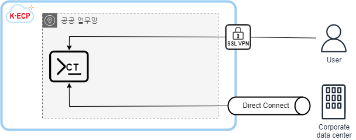

[문서 최종 수정일자 : 2023-05-16]: # 
[문서 최종 수정자 : 신승규]: # 

# VM Server 시작하기

이 안내서를 사용하여 **K-ECP VM Server(이하. VM)*** 서비스를 시작 하십시오. VM의 서비스 신청서를 작성하고 시작하는 방법을 안내합니다. 

VM은 K-ECP에서 서버를 생성하여 컴퓨팅 인프라를 가상화하여 제공하는 서비스 입니다. 필요한 시점에 필요한 만큼 자유롭게 리소스를 할당 받아 사용할 수 있습니다. 사용한 만큼 요금을 지불하여 원하는 하드웨어 사양을 합리적인 가격으로 이용할 수 있습니다.

### 관련 안내서

* Project 만들기
* SSL VPN 시작하기
* Storage 시작하기
* VM Backup 시작하기

### 목차

[개요](#abstract)

[전제 조건](#precondition)

[1단계: VM Server 서비스 신청](#step1)

[2단계: VM Server 접속](#step2)

[3단계: VM Server 사용](#step3)

[4단계:VM Server 정리](#step4)

[다음 단계](#nextstep)

---

<span id="abstract"/>

## 개요

K-ECP VM 서비스를 사용하기 위해서는 아래와 같은 프로세스로 진행되며, **KDN의 직원일 경우 User Console에서 소속 부서장의 결재**가 필요합니다.


K-ECP VM은 User Console를 통해 신청한 후 최종 승인 시 사용 가능합니다. 아래 개념도와 같이 **SSL-VPN 또는 전용선(Direct Connect 서비스 사용시)을 이용하여 접속**하실 수 있습니다.

  

VM 신청 시 서버 운영 목적에 따라 다음과 같은 다양한 이미지를 제공 받을 수 있습니다.

* RHEL 7.9, RHEL 8.4
* WEB 서버: Nginx, Apache HTTP
* WAS 서버: Tomcat WAS, Jetty WAS, JBoss WAS
* DB 서버: Maria DB, PostgreSQL DB, Cubrid DB
* 개발 서버: Apache Tomcat MariaDB, Nginx Tomcat MariaDB

---

<span id="precondition"/>

## 전제 조건

* 시작하기 전에 [K-ECP User Console](https://kecp.kdn.com/mbr/ "인터넷에서 접속 시")에 회원가입이 되어 있어야 합니다. 

* 사전에 VM을 신청할 프로젝트가 생성되어 있어야 합니다. 

> :bulb: **Tip:** KDN 직원의 경우  KDN 내부망에서 [KDN 전용 User Console](http://kdnecp.kdn.com:8585/mbr/ "KDN 내부망에서 접속 시")로도 접속이 가능합니다.

---

<span id="step1"/>

## 1단계: VM Server 서비스 신청

1. K-ECP User Console에서 `[서비스 신청] 자원 > 가상서버 신청`에서 원하는 서버 이미지의 돋보기 아이콘:mag: 클릭

2. 서비스 신청서 내역 작성  
   
   * 프로젝트명: *VM이 포함되어야 될 기 생성완료된 프로젝트 선택*
   
   * 서버대역: *VM에 할당될 IP Subnet 대역 선택* 
   
   * 네트워크: *VM에 할당될 네트워크 대역 선택*
   
   * 운영체제: *선택한 이미지 자동 설정*
   
   * 서버명: *운영목적에 맞게 서버명 작성*
   
   * DISK: *50GB 기본 설정*
   
   > :bulb:**Tip**: 추가 DISK를 원할 경우 [스토리지 신청](http://kdnecp.kdn.com:8585/mbr/ "스토리지 시작하기")을 통해 서버에 추가 할당 할 수 있습니다.
   
   * 서버사양: 소형서버, 중형서버, 대형서버, CPU-Intensive, Memory-Intensive 중 선택 후 서버 스펙 선택
   
   > :bulb:**Tip**: 상세 사양 및 요금은 [요금표](http://kdnecp.kdn.com:8585/mbr/ "KDN 요금표")에서 확인 가능합니다.
   
   * 백업네트워크: 포함 선택시 `Backup IP`추가 할당

3. `신청` 버튼을 클릭 하여 VM 서비스 신청 (단, KDN 직원일 경우 소속 부서장으로 결재자 지정 후 서비스 신청)

---

<span id="step2"/>

## 2단계: VM Server 접속

> :warning: **주의사항:** K-ECP SSL VPN이 사전에 신청되어 있어야 합니다.

1. VM 서비스 신청 승인이 완료 된 경우 K-ECP User Console에서 `서비스 현황 > 가상서버`로 이동하여 해당 프로젝트의 돋보기:mag: 아이콘 클릭

2. 선택된 프로젝트내에 VM의 **IP 주소 확인**

3. `[서비스 신청] 기술지원 > 관리서비스 신청 > 보안작업 서비스 신청`의 돋보기 아이콘:mag: 클릭

4. 보안적업 서비스 신청정보 기술 후 `신청` 요청
   
   * 클러스터: *VM가 생성된 클러스터 선택*
   
   * 프로젝트명: *VM가 생성된 프로젝트 선택*
   
   * 가상서버: *해당 VM 선택*
   
   * 서비스명: *`SSL VPN 접속 가능서버 추가 요청` 기술*

5. K-ECP 운영팀으로 부터 보안작업 완료 통보를 받은 후 인터넷 가능환경에서 브라우저를 통해 [K-ECP SSL VPN](https://kecp-vpn.kdn.com/) 접속 

> :bell: **안내:** SSL VPN 접속방법 및 사용법은 [SSL VPN 시작하기](http://kdnecp.kdn.com:8585/mbr/ "SSL VPN 시작하기")가이드 문서 참고

6. K-ECP 운영팀으로 부터 VM서버의 초기 ID/PW을 전달 받은 후 SSH 프로토콜을 통해 서버 접속
   
   ```주절
   $ssh -p 10040 kecpuser@[CT_IP]
   ```

> :warning: **주의사항:** 접속 후 초기PW 변경이 필요합니다.

---

<span id="step3"/>

## 3단계: Container Terminal 사용

1. K-ECP 운영팀에게 OpenShift의 원하는 PW 전달

> :bell:**안내**:원하는 PW가 없는 경우 K-ECP 운영팀에서 임의 설정

2. 접속한 CT서버에서 OpenShift 로그인

```주절
$oc login -u [ID] https://api.ocp4.kdnecp.com:6443
```

3. Openshift 접속 확인
* 접속확인

```주절이
Login successful.
You have one project on this server: "[server_name]"
Using project "[server_name]".
```

* 접속 계정 확인 명령어

```주절이
$oc whoami
```

```주절이
[ID]
```

---

<span id="step4"/>

## 4단계: Container Terminal 정리

1. `oc`명령어를 통해 CT에서 OpenShift계정 로그아웃을 할 수 있습니다.
   
   ```주절이
   $oc logout
   ```
   
   ```주절이
   Logged "[ID]" out on "https:api.ocp4.kdnecp.com:6443"
   ```

2. CT자원을 완전히 삭제하길 원하는 경우 `서비스 변경 및 삭제 신청 > 삭제신청`로 이동
* 프로젝트: 해당`CT`가 있는 프로젝트 선택

* 자원: 가상서버, `CT`의 서버 선택

* `x삭제신청` 버튼 클릭  

> :warning:**주의사항**:CT 서비스를 삭제할 경우 OpenShift계정 또한 삭제됩니다.

---

<span id="nextstep"/>

## 다음 단계

`CT`서비스 시작한 후 다음과 같은 명령어를 통해 컨테이너를 관리할 수 있습니다.

* `$oc status`: 서비스, 배포, 빌드 구성 등 현재 프로젝트에 대한 정보 확인

```주절
$oc status
In project SSG-TEST (ssg-test-del) on server https://api.ocp4.kdnecp.com:6443

http://ssgtest-ssg-test-del.apps.ocp4.kdnecp.com (svc/ssgtest)
  dc/ssgtest deploys istag/ssgtest:latest <-
    bc/ssgtest source builds http://10.100.11.114/222216/k-ecp-test-delete.git on openshift/jboss-webserver56-openjdk11-tomcat9-openshift-ubi8:5.6.0
    deployment #4 deployed 3 days ago - 1 pod
    deployment #3 deployed 3 days ago
    deployment #2 deployed 3 days ago
```

* `$oc projects`: 내 프로젝트

* `$oc project [project_name]`: 프로젝트[project_name] 선택

```주절이
$oc projects
Using Project "[project_name]" on server "https://api.ocp4.kdnecp.com:6443"
```

* `oc get pod`: Pod 정보 확인

```주절이
$oc get pod
NAME               READY   STATUS      RESTARTS   AGE
ssg0412-2-build    0/1     Completed   0          32d
ssg0412-3-build    0/1     Completed   0          32d
ssgtest-1-build    0/1     Completed   0          20d
ssgtest-1-deploy   0/1     Completed   0          20d
ssgtest-2-build    0/1     Completed   0          3d20h
ssgtest-2-deploy   0/1     Completed   0          3d20h
ssgtest-3-build    0/1     Completed   0          3d20h
ssgtest-3-deploy   0/1     Completed   0          3d20h
ssgtest-4-465g4    1/1     Running     0          3d6h
ssgtest-4-build    0/1     Completed   0          3d6h
ssgtest-4-deploy   0/1     Completed   0          3d6h
```

* `oc rsh [pod_name]`:컨테이너 내의 [pod_name]로 접속

```주절이
$oc rsh [pod_name]
oc rsh [pod_name]>
```
