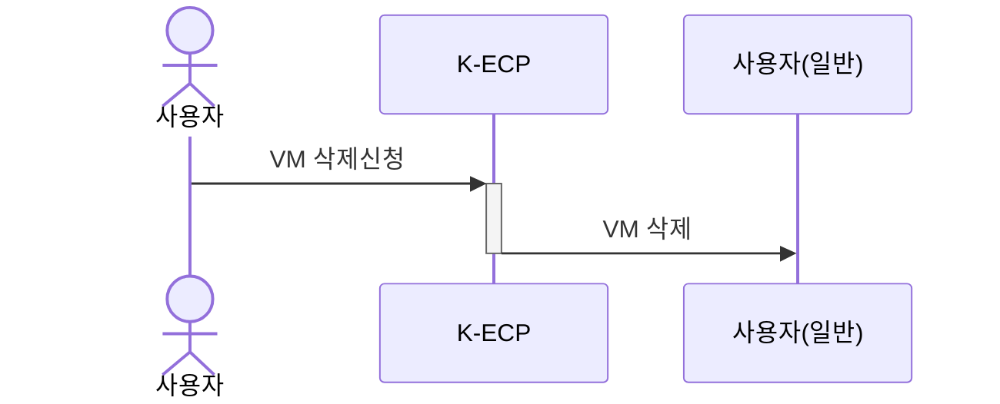

[문서 최종 수정일자 : 2023-09-11]: # 

[문서 최종 수정자 : 신승규]: # 

# VM Server 삭제하기

이 안내서를 사용하여 **K-ECP Virtual Machine Server(이하. VM)** 자원을 삭제할 수 있습니다. VM 자원 삭제 신청서를 작성하고 정리하는 방법을 안내합니다.

사용하지 않는 VM 서비스를 삭제하여 자원낭비를 줄여 효율적으로 K-ECP 서비스를 활용할 수 있습니다.

### 관련 안내서

* [VM Server 시작하기](./VirtualMachine_started.md)
* [Block Storage 삭제하기](./BlockStorage_delete.md)
* [File Storage 삭제하기](./FileStorage_delete.md)

### 목차

[개요](#abstract)

[전제 조건](#precondition)

[1단계: 추가자원 정리](#step1)

[2단계: VM Server 정리](#step2)

[3단계: VM Server 삭제](#step3)

[다음 단계](#nextstep)

---

## 개요

K-ECP VM 서비스를 삭제하기 위해서는 아래와 같은 프로세스로 진행됩니다.

---

## 전제 조건

* 삭제 가능한 VM 서비스가 존재해야합니다.

---

## 1단계: 추가자원 정리

> :warning: **주의사항:** 추가자원을 정리하면 해당 자원에 저장된 데이터를 복구할 수 없습니다.

1. K-ECP User Console에서 `서비스 현황 > 스토리지`에서 삭제하려는 VM이 속한 프로젝트의 돋보기 아이콘:mag: 클릭

2. 스토리지 현황 상세 페이지에서 해당 VM에서 사용중인 Block Storage와 File Storage 확인
   
   * Block Storage 정리
   
   [Block Storage 삭제하기](./BlockStorage_delete.md)를 통하여 해당 VM에 할당된 Block Storage를 정리하세요
   
   * File Storage 정리
   
   [File Storage 삭제하기](./FileStorage_delete.md)를 통하여 해당 VM에 할당된 File Storage를 정리하세요
   
   > :warning: **주의사항:** FileStorage를 정리하면 해당 FileStorage를 공유하는 VM에서도 해당 FileStorage를 사용할 수 없습니다.

---

## 2단계: VM Server 정리

> :warning: **주의사항:** VM 서비스를 정리하는 경우 해당 VM에 저장된 데이터를 복구할 수 없습니다.

1. K-ECP User Console에서 `서비스 현황 > 가상서버`에서 삭제하려는 VM이 속한 프로젝트의 돋보기 아이콘:mag: 클릭

2. 가상서버 현황 상세페이지에서 삭제하려는 VM의 정지:white_square_button:버튼 클릭
* 전원상태가 SHUTOFF임을 확인

---

## 3단계: VM Server 삭제 신청

1. K-ECP User Console에서 `서비스 변경 및 삭제 신청` 클릭

2. 서비스 변경 및 삭제 신청 페이지에서 삭제신청 탭 클릭

3. 삭제신청 내역 작성
   
   * 프로젝트: *삭제할 VM이 포함된 프로젝트 선택*
   
   * 자원: *가상서버 선택*
   
   * 가상서버 검색: *서버명을 확인하여 삭제할 VM을 선택*

4. 삭제신청 버튼 클릭

---

## 다음 단계

* VM삭제를 통해서 프로젝트에서 사용하지 않는 자원을 정리하여 K-ECP 서비스 사용시 비용을 절감하여 사용할 수 있습니다.
