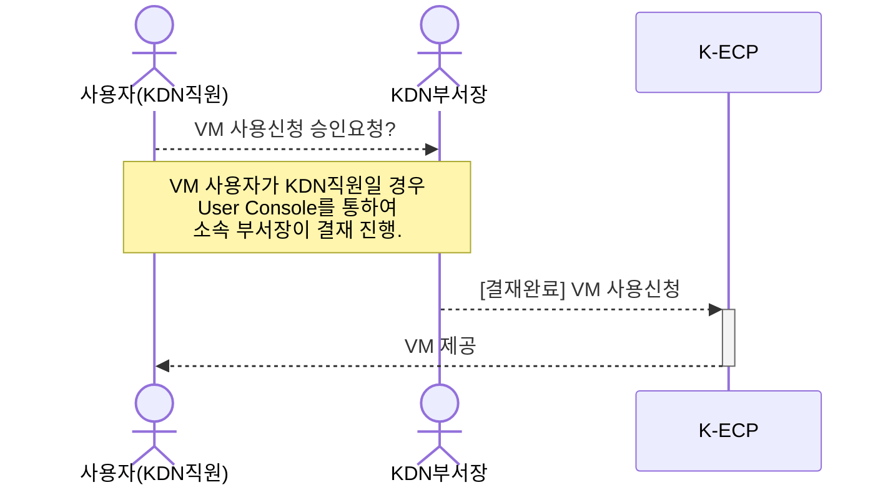
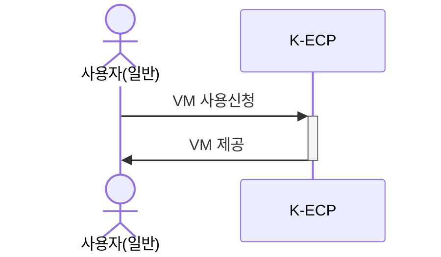
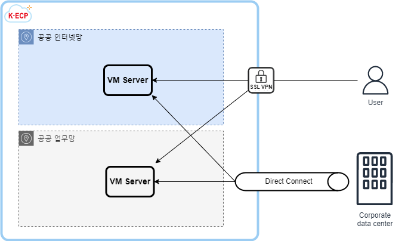

[문서 최종 수정일자 : 2023-05-16]: # 
[문서 최종 수정자 : 신승규]: # 

# VM Server 시작하기

이 안내서를 사용하여 **K-ECP Virtual Machine Server(이하. VM)** 서비스를 시작 하십시오. VM 서비스 신청서를 작성하고 시작하는 방법을 안내합니다. 

VM은 K-ECP에서 서버를 생성하여 컴퓨팅 인프라를 가상화하여 제공하는 서비스 입니다. 필요한 시점에 필요한 만큼 자유롭게 리소스를 할당 받아 사용할 수 있습니다. 사용한 만큼 요금을 지불하여 원하는 하드웨어 사양을 합리적인 가격으로 이용할 수 있습니다.

### 관련 안내서

* [Project 만들기](./Project.md)
* [SSL VPN 시작하기](./SSLVPN_started.md)
* [Storage 시작하기](./Storage_started)
* VM Backup 시작하기

### 목차

[개요](#abstract)

[전제 조건](#precondition)

[1단계: VM Server 서비스 신청](#step1)

[2단계: VM Server 접속](#step2)

[3단계: VM Server 사용](#step3)

[다음 단계](#nextstep)

---

<span id="abstract"/>

## 개요

K-ECP VM 서비스를 사용하기 위해서는 아래와 같은 프로세스로 진행되며, **KDN의 직원일 경우 User Console에서 소속 부서장의 결재**가 필요합니다.

* KDN 직원인 경우

* 일반 사용자인 경우


K-ECP VM은 User Console를 통해 신청한 후 최종 승인 시 사용 가능합니다. 아래 개념도와 같이 **SSL-VPN 또는 전용선(Direct Connect 서비스 사용시)을 이용하여 접속**하실 수 있습니다. 접속 가능 영역으로는 공공 인터넷 영역(DMZ)와 공공 업무망 영역이 있습니다.



VM 신청 시 서버 운영 목적에 따라 다음과 같은 다양한 이미지를 제공 받을 수 있습니다.

* OS: RHEL 7.9, RHEL 8.4
* WEB 서버: Nginx, Apache HTTP
* WAS 서버: Tomcat WAS, Jetty WAS, JBoss WAS
* DB 서버: Maria DB, PostgreSQL DB, Cubrid DB
* 개발 서버: Apache Tomcat MariaDB, Nginx Tomcat MariaDB

---

<span id="precondition"/>

## 전제 조건

* 시작하기 전에 [K-ECP User Console](https://kecp.kdn.com/mbr/ "인터넷에서 접속 시")에 회원가입이 되어 있어야 합니다. 

* 사전에 VM을 신청할 프로젝트가 생성되어 있어야 합니다. 

> :bulb: **Tip:** KDN 직원의 경우  KDN 내부망에서 [KDN 전용 User Console](http://kdnecp.kdn.com:8585/mbr/ "KDN 내부망에서 접속 시")로도 접속이 가능합니다.

---

<span id="step1"/>

## 1단계: VM Server 서비스 신청

1. K-ECP User Console에서 `[서비스 신청] 자원 > 가상서버 신청`에서 원하는 서버 이미지의 돋보기 아이콘:mag: 클릭

2. 서비스 신청서 내역 작성  
   
   * 프로젝트명: *VM이 포함되어야 될 기 생성완료된 프로젝트 선택*
   
   * 서버대역: *VM에 할당될 IP Subnet 대역 선택* 
   
   * 네트워크: *VM에 할당될 네트워크 대역 선택*
   
   * 운영체제: *선택한 이미지 자동 설정*
   
   * 서버명: *운영목적에 맞게 서버명 작성*
   
   * DISK: *50GB 기본 설정* (변경 불가)
   
   > :bulb:**Tip**: 추가 DISK를 원할 경우 [Block Storage 시작하기](./BlockStorage_started.md)를 통해 서버에 추가 할당 할 수 있습니다.
   
   * 서버사양: 소형서버, 중형서버, 대형서버, CPU-Intensive, Memory-Intensive 중 선택 후 서버 스펙 선택
   
   > :bulb:**Tip**: 상세 사양 및 요금은 K-ECP요금표에서 확인 가능합니다.
   
   * 백업네트워크: 포함 선택시 `Backup IP`추가 할당

3. `신청` 버튼을 클릭 하여 VM 서비스 신청 (단, KDN 직원일 경우 소속 부서장으로 결재자 지정 후 서비스 신청)

---

<span id="step2"/>

## 2단계: VM Server 접속

> :warning: **주의사항:** K-ECP SSL VPN이 사전에 신청되어 있어야 합니다.

1. VM 서비스 신청 승인이 완료 된 경우 K-ECP User Console에서 `서비스 현황 > 가상서버`로 이동하여 해당 프로젝트의 돋보기:mag: 아이콘 클릭

2. 선택된 프로젝트내에 VM의 **IP 주소 확인**

3. K-ECP 운영팀으로 부터 보안작업 완료 통보를 받은 후 인터넷 가능환경에서 브라우저를 통해 [K-ECP SSL VPN](https://kecp-vpn.kdn.com/) 접속 

> :bell: **안내:** SSL VPN 접속방법 및 사용법은 [SSL VPN 시작하기](./SSLVPN_started.md)가이드 문서를 참고 바랍니다.

4. [보안그룹 시작하기](./SecurityGroup_started.md)를 통해 vpn으로 부터 서버접근 허용 작업 수행

5. K-ECP 운영팀으로 부터 VM서버의 초기 ID/PW을 전달 받은 후 SSH 프로토콜을 통해 서버 접속(SSH 프로토콜 클라이언트에서 실행)
   **해당 가이드의 예시의 경우 윈도우 명령 프롬프트에서 실행**
   ```powershell
   ssh -p [ssh Port] kecpuser@[VM_IP_address]
   ```

6. 초기 비밀번호 입력 후 로그인
   
   ```powershell
   kecpuser@[VM]'s password:
   Last login: Wed May 31 13:41:07 2023 from 10.100.8.50
   #################################################################
   #                   _    _           _   _                      #
   #                  / \  | | ___ _ __| |_| |                     #
   #                 / _ \ | |/ _ \ '__| __| |                     #
   #                / ___ \| |  __/ |  | |_|_|                     #
   #               /_/   \_\_|\___|_|   \__(_)                     #
   #                                                               #
   #           You are entering into a secured area!               #
   #                                                               #
   #                      This service                             #
   #                   is restricted  to                           #
   #           Cloud Department Administrator only.                #
   #                                                               #
   #          All activities on this system are logged.            #
   #  Unauthorized access will be fully investigated and reported  #
   #        to the appropriate law enforcement agencies.           #
   #################################################################
   Last login: Wed May 31 13:41:07 2023 from [IP]
   ```

> :bell: **안내:** 접속 후 초기 비밀번호의 변경이 필요합니다.

---

<span id="step3"/>

## 3단계: VM Server 사용

> :bell:**안내**: K-ECP User Console에서 가상서버 기동 및 상태를 확인할 수 있습니다.

1. K-ECP User Console에서`서비스현황 > 가상서버`이동 후 해당 VM이 속한 프로젝트의 돋보기 아이콘:mag: 클릭
   
   * 운전상태: ACTIVE / SHUTDOWN 등 현재 서버의 상태를 확인할 수 있습니다.
   
   * 정지 :white_square_button::  ACTICE 상태의 서버를 중지할 수 있습니다.
   
   * 시작 :arrow_forward:: SHUTDOWN 상태의 서버를 기동시킬 수 있습니다.
   
   * 재시작 :arrows_counterclockwise:: 해당 서버를 재기동 할 수 있습니다.
   
   * 보안그룹 :mag:: [보안그룹 시작하기](./SecurityGroup_started.md)를 통해 서버 접근을 설정할 수 있습니다.
   
   * 상세 :mag:: 상세 페이지를 통해서 해당 가상서버의 상세 사항 확인 및 `서버명` 수정, VM 변경 및 해지하기를 사용할 수 있습니다.

---

<span id="nextstep"/>

## 다음 단계

* [Block Storage시작하기](./BlockStorage_started.md)를 통해 `VM`의 Storage를 추가할 수 있습니다.

* VM 변경 및 해지하기를 통해 사용중인 `VM`서비스를 반납할 수 있습니다.(향후 제공 예정)
